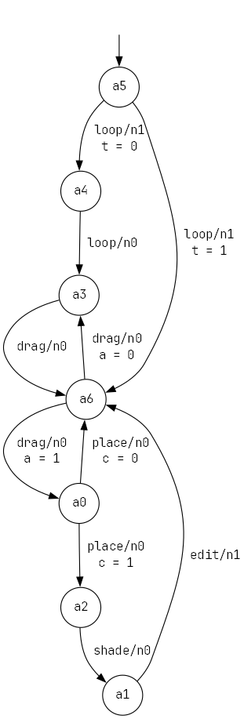

# Реализация конечного автомата Мили



## Описание
Проект реализует конечный автомат Мили на основе предоставленной диаграммы состояний. Автомат выполняет переходы между состояниями в зависимости от вызываемых методов и значений переменных.

## Требования
- Python 3.x
- Изображение с диаграммой состояний (1.png)

## Реализация

### Класс MealyMachine
Основной класс, реализующий конечный автомат с следующими возможностями:
- Переходы между состояниями при вызове методов
- Условные переходы на основе переменных
- Обработка ошибок при недопустимых переходах
- Методы анализа графа состояний

### Основные методы
| Метод | Описание |
|-------|----------|
| `set_var(имя, значение)` | Устанавливает переменные для условных переходов |
| `has_max_in_edges()` | Проверяет, имеет ли текущее состояние максимальное количество входящих ребер |
| `part_of_loop()` | Проверяет, является ли текущее состояние частью цикла |
| Методы перехода | Названия соответствуют меткам на ребрах графа (например `loop()`, `drag()`) |

### Обработка ошибок
- **`MealyError`** - пользовательский класс исключений с сообщениями:
  - `'unsupported'`: метод существует, но не поддерживается в текущем состоянии
  - `'unknown'`: метод не существует в автомате

## Пример использования
```python
obj = main()  # Создание экземпляра автомата
obj.set_var('a', 1)  # Установка переменной
obj.part_of_loop()  # Вернет False
obj.loop()  # Переход в следующее состояние
obj.drag()  # Переход в другое состояние
obj.set_var('a', 0)  # Изменение переменной
